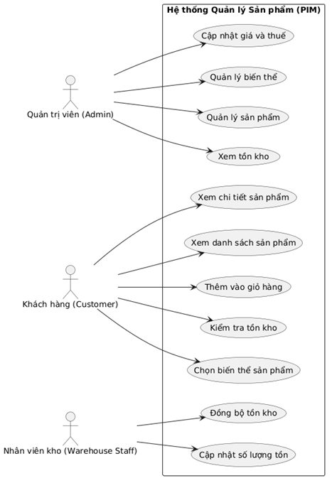
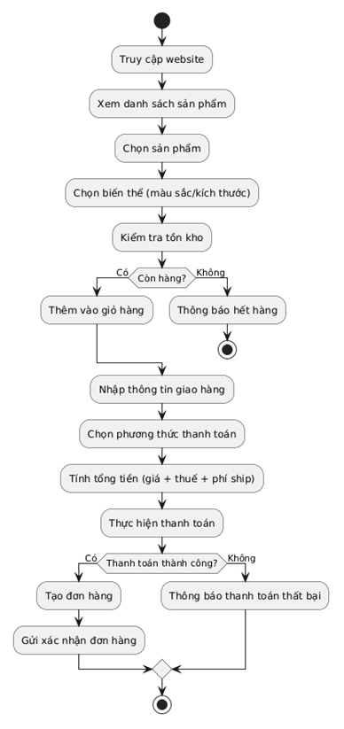

# THIẾT KẾ SRS HỆ THỐNG E-COMMERCE - P1
##[2.1] Quản lý Sản phẩm (PIM)

---

**Họ và tên:** Nguyễn Trung Hiếu  
**MSV:** 23810310387  

---

## Phần 1: Mô hình hóa quy trình (Business Flow)

### 1.1. Sơ đồ Use Case

---

### 1.2. Sơ đồ Activity

---

## Phần 2: Đặc tả chức năng (Functional Requirements)

### Nhóm Admin
- Là một Admin, tôi muốn thêm sản phẩm mới để bán hàng trên hệ thống.  
- Là một Admin, tôi muốn tạo các biến thể sản phẩm (màu, kích thước) để quản lý chi tiết từng loại.  
- Là một Admin, tôi muốn cập nhật giá bán và thuế VAT để đảm bảo tính đúng giá trị đơn hàng.  
- Là một Admin, tôi muốn xem tồn kho theo từng biến thể để kiểm soát hàng hóa.  

### Nhóm Customer
- Là một khách hàng, tôi muốn xem thông tin chi tiết sản phẩm để lựa chọn phù hợp.  
- Là một khách hàng, tôi muốn biết sản phẩm còn hàng hay không theo thời gian thực.  
- Là một khách hàng, tôi muốn chọn biến thể sản phẩm trước khi mua.  
- Là một khách hàng, tôi muốn nhận được email xác nhận đơn hàng ngay sau khi thanh toán để tôi an tâm về giao dịch.  

### Nhóm Warehouse Staff
- Là một nhân viên kho, tôi muốn cập nhật số lượng tồn kho để hệ thống phản ánh đúng thực tế.  
- Là một nhân viên kho, tôi muốn hệ thống tự động trừ tồn kho khi có đơn hàng.  

---

## Phần 3: Đặc tả dữ liệu (Data Schema)

### 3.1. Partner

| Trường         | Kiểu dữ liệu | Mô tả                |
|---------------|-------------|----------------------|
| id            | int         | ID khách hàng        |
| name          | string      | Tên khách hàng       |
| tax_code      | string      | MST (nếu có)         |
| email         | string      | Email                |
| phone         | string      | SĐT                  |
| address       | string      | Địa chỉ giao hàng    |
| customer_type | string      | Guest / B2C / B2B    |

---

### 3.2. Product

| Trường      | Kiểu dữ liệu | Mô tả             |
|------------|-------------|-------------------|
| id         | int         | ID sản phẩm       |
| name       | string      | Tên sản phẩm      |
| sku        | string      | Mã SKU            |
| barcode    | string      | Mã vạch           |
| price      | decimal     | Giá bán           |
| vat        | float       | Thuế VAT (%)      |
| description| text        | Mô tả             |
| status     | enum        | Active / Inactive |

---

### 3.3. Order

| Trường        | Kiểu dữ liệu | Mô tả                        |
|--------------|-------------|------------------------------|
| id           | int         | ID đơn hàng                  |
| order_amount | int         | Số đơn hàng                  |
| partner_id   | int         | Khách hàng                   |
| total_price  | decimal     | Tổng tiền                    |
| status       | enum        | Draft / Confirmed / Cancelled|
| created_at   | datetime    | Ngày tạo                     |
